# vocab-quiz

Create a technical solution for a real-time quiz feature for an English learning application. This feature will allow users to answer questions in real-time, compete with others, and see their scores updated live on a leaderboard.

## Requirements

[Requirements](Requirements.md)

## High-Level Architecture
This document provides a high-level overview of the architecture of a real-time quiz application.

The app is built on microsevice architecture, integrates between technologies, including `Node.js` (`Nest.js`), `PostgresQL`, Caching with `Redis`, and Messaging Queue with `RabbitMQ`, `TypeORM`, `JWT`

The architecture is designed to handle real-time interactions, user sessions, and efficient data management.

## Component Descriptions

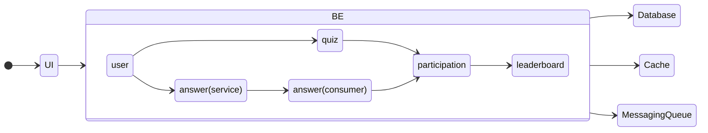

The diagram above shows us in general overview between components. The BE system is designed to be deployed on Kubernetes so I have seperate all of group function into every small service with their own database.

JWT authentication mechanism is used for token introspection for all service communication. 
Hence, a Bearer token in header for every request between service need to be used.

### User Service

Manages user authentication, registration, and user-related data.

Endpoints:
- Register user
- Authenticate user
- Fetch user token
- Introspec token for all service comunication

Database: Users Table

### Quiz Service

Manages the creation of quizzes, quiz sessions, and questions.

Endpoints:
- Create quiz
- Get quiz details and questions
- Manage quiz sessions (e.g., start/end a quiz)

Database: Quiz Table, Questions Table

### Participation Service

Handles user participation, joining quizzes, and tracking scores.

Endpoints:
- Join quiz session
- Fetch joined quizzes

Database: User_Quiz Table

### Answer Service

Receive and Publishes answer submissions to Message Queue

Endpoints:
- Submit answer

Database: Answers Table

### Answer Consumer

- Consumes messages related to answer submissions and score updates. 
- Checks answers for correctness, and updates scores.
- Publish scored & noti to MQ answer_point

### Participation Service

- Consume queue and count on answer_point to get total score
- Updates the score to Db
- Save list of user's score based on quizId to cache
- Publish noti to MQ to notify Leaderboard

### Leaderboard Service

- Leaderboard get notified when score changed by consume message from MQ
- Read total score
- Get scored from Redis to update score to the Leaderboard
- WebSocket Integration: Uses WebSockets to push leaderboard updates to connected clients.

Endpoints:
- Fetch current leaderboard

Data Source: Reads from the User_Quiz Table (for scores) and Redis.


### Database
#### user
The database `user` uses only `user` table to store user informations, password for managing session and generate JWT

#### quiz
Collection of Question will be stored into table `question` and list of Quiz wil be in `quiz` table.

#### answer
User's answer have to store into `answer` table.


#### userquiz
Indicate user join a quiz and total score.

## Technology Justification

#### Microservice
Using Containerization of Backend Services

Docker: Containerize all backend services using Docker. Each service will run in its own container, providing isolation and consistency across different environments. This allows for easier deployment, scaling, and management of dependencies.

Container Orchestration: Utilize a container orchestration platform such as Kubernetes to manage and scale containerized services. Kubernetes provides automated deployment, scaling, and management of containerized applications, ensuring high availability and resource efficiency.

Load Balancing: Configure an ingress controller in Kubernetes to handle external traffic and distribute it to the appropriate backend services. This ensures that requests are efficiently routed and helps manage scaling.

#### Web Framework: 
Use frameworks like Node.js/Nestjs to build each microservice.

#### Message Queue: 
Use RabbitMQ or Kafka to handle event-driven communication between services.

#### Database: 
- Use a relational database like PostgreSQL for structured data storage.
- Using TypeORM - efficient way to manage database in a Node.js application, especially with TypeScript. It simplifies database interactions, offers strong type safety, and supports features like migrations, easy relationship management, and a powerful query builder.

#### Cache: 
Use Redis for caching leaderboard data and reducing database load.

#### WebSockets: 
Use libraries like Socket.IO (for Node.js) or native WebSocket implementations for real-time updates.


# Integration Strategy

## Data Flow
Here's how we can use Message Queue and WebSockets for real-time performance and reliability.

### Sequence flow IAM

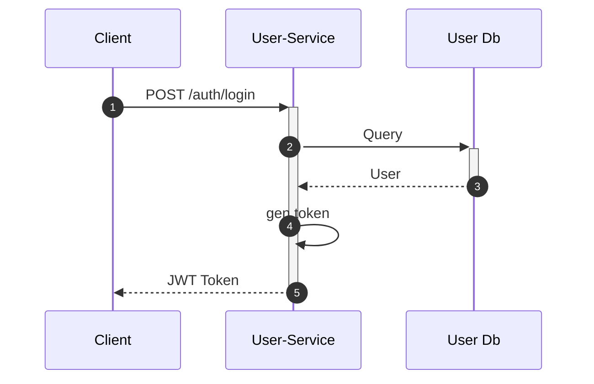

### Sequence flow Sevice to sevice communication

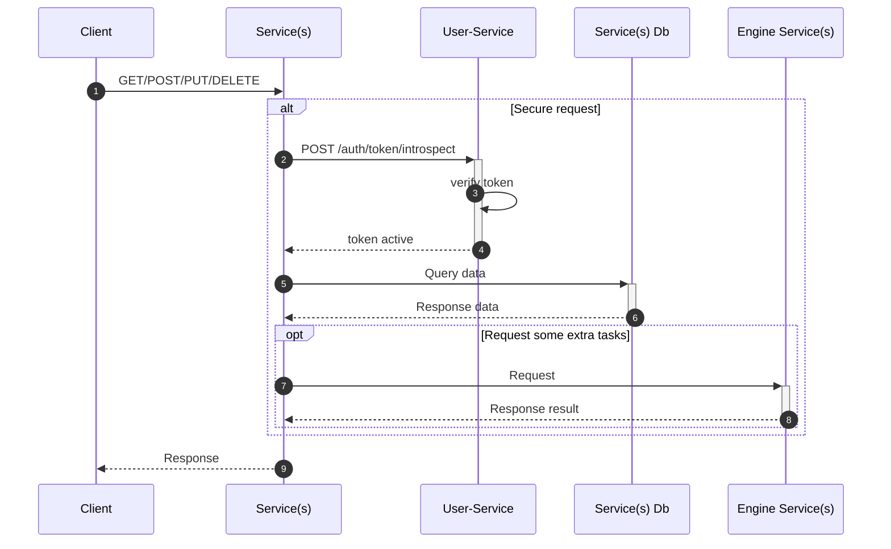

### Sequence flow End-to-end

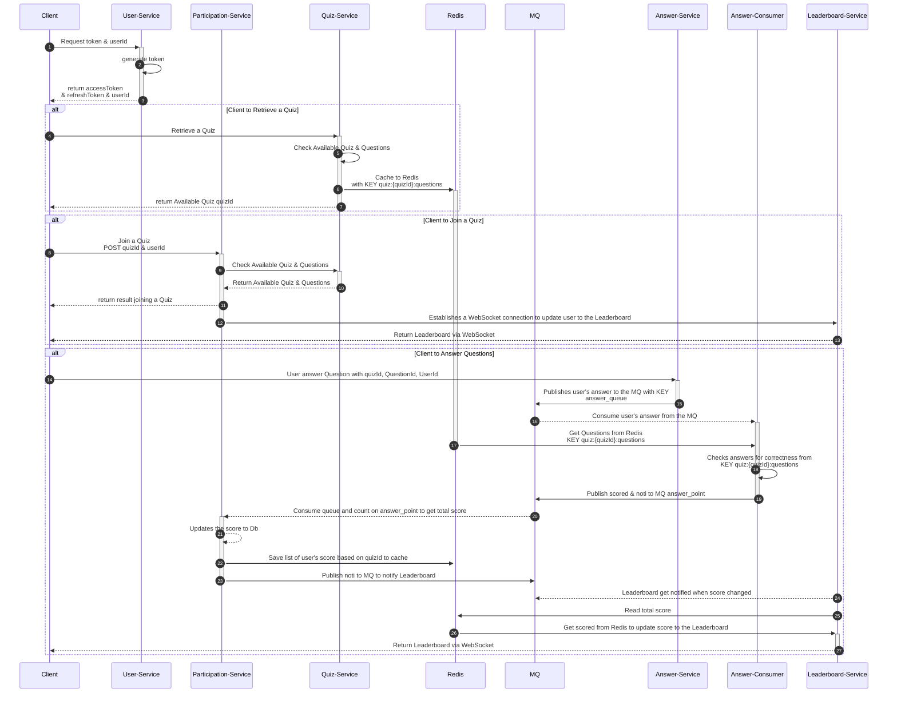

# Demo

## Play on youtube:

[Play on youtube](https://youtu.be/H14kp9VWlcI?si=b75-zGMFuTU44oDl)

[](https://www.youtube.com/watch?v=H14kp9VWlcI "Vocab-Quiz-Microsevice-MQ-Redis")

## Playground

### Prerequisites

- Docker Desktop (latest version)
- Nodejs 20.x, Nest.js CLI 10.0.0
- PostgresDB 15.x
- Postman, [postman collection](resource/vocab-qz.postman_collection.json)
- Git

### System Requirements
- Minimum 4GB RAM
- Port availability: 
    - 3001-3006: Nestjs service
    - 6379: Redis
    - 5432: Postgres
    - 5672: RABBITMQ

### Running the app

In every project, **Set up environment variables** by changing the information in `.env`.

- development:
```
npm i
npm run start
```

- or just run from dist/ pre-built:
```
npm i
node dist/main.js
```

The project has been running on its own port.

Run the RabbitMQ and Redis:

```
docker run -it --rm --name rabbitmq -p 5672:5672 -p 15672:15672 rabbitmq:4.0-management
docker run -it --rm --name redis -p 6379:6379 -d redis
```

### Deployment

Using Docker to build and run image.

## Live API

I have deployed the sevice on K8s. Just import [postman collection](resource/vocab-qz.postman_collection.json), under folder `Live/Dev`

- Base Url: `https://api-dev.nready.net/vocab-quiz`
- User Service: `/user/v1/`
- Quiz Service: `/quiz/v1/`
- Participation Service: `/participation/v1/`
- Answer Service: `/answer/v1/`
- Leader board Service: `/leaderboard/v1/`

### 

## Screenshot

1. Start service

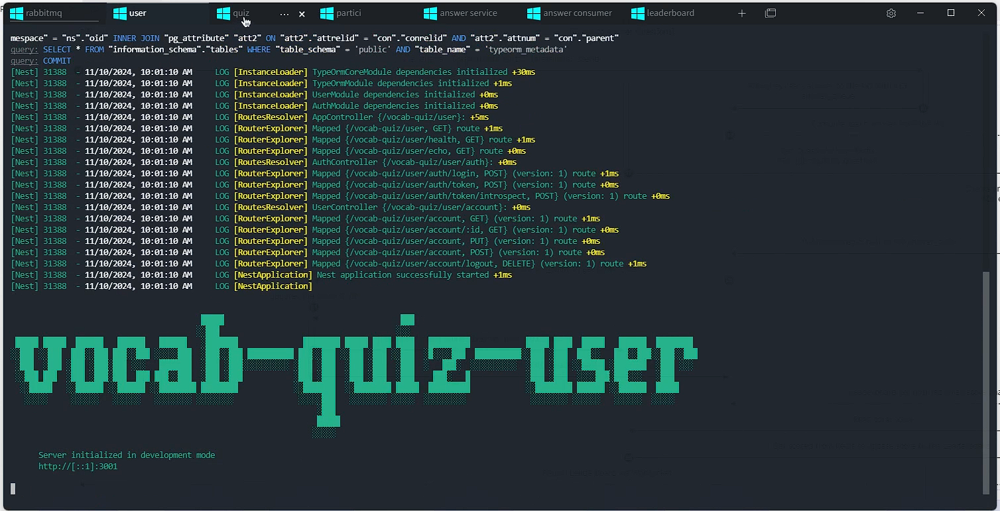

2. User get token by login/refreshtoken

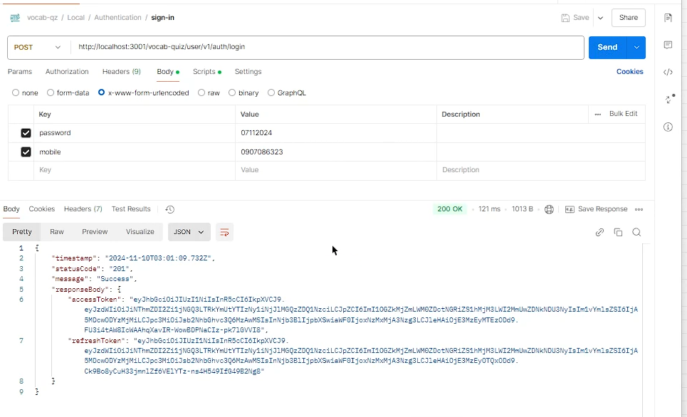

3. User get a Quiz by Id to join

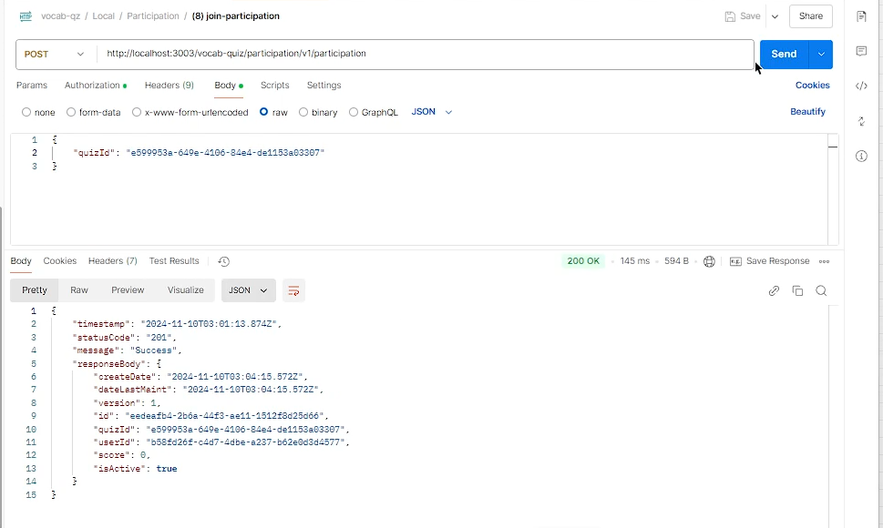

4. User answering a question

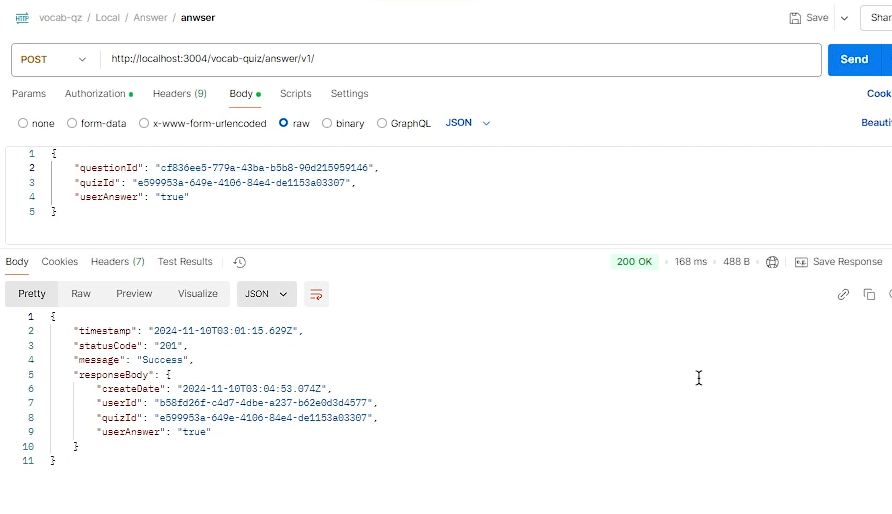


5. The AnswerService has received answer

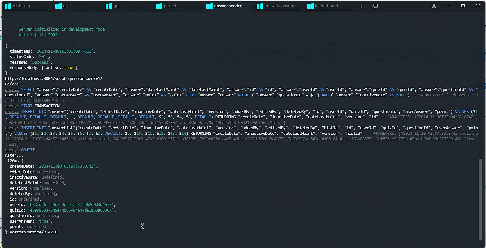


6. The AnswerConsumer consume answer and check

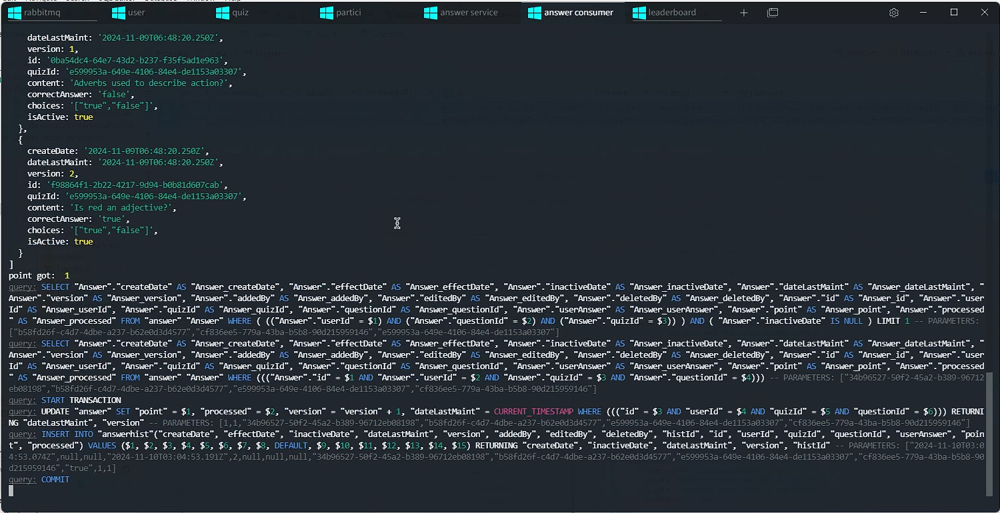


7. AnswerConsumer push message about point to ParticipationService

ParticipationService listening and received the message.

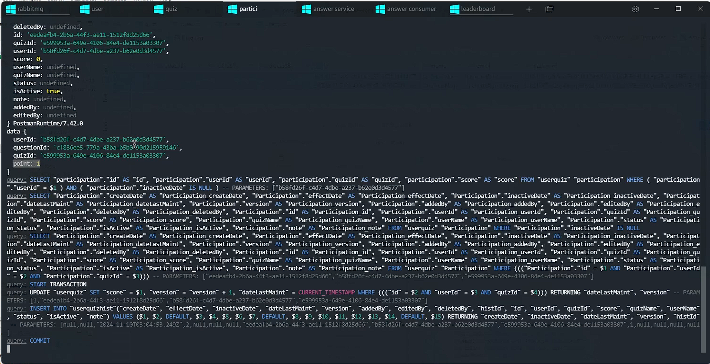


8. ParticipationService noti the leaderboard by push a noti message

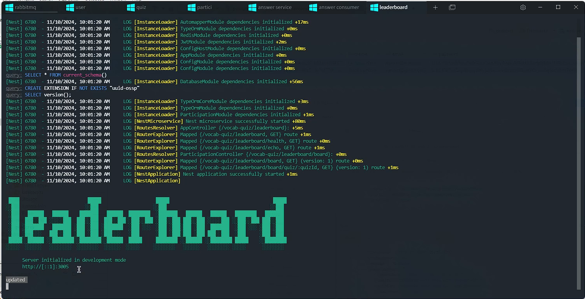


9. Check the score has been updated

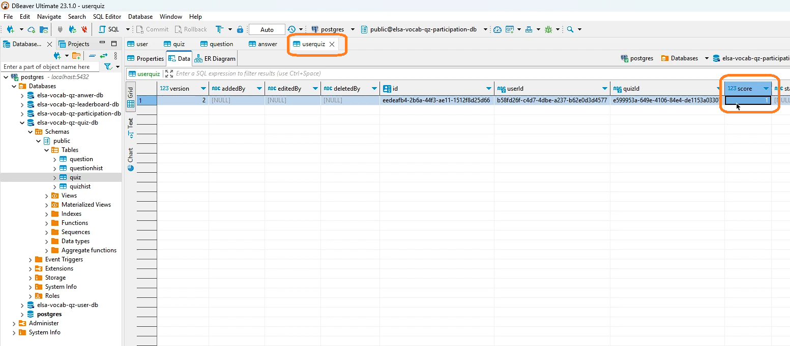

10. Deployment on K8s with Rancher

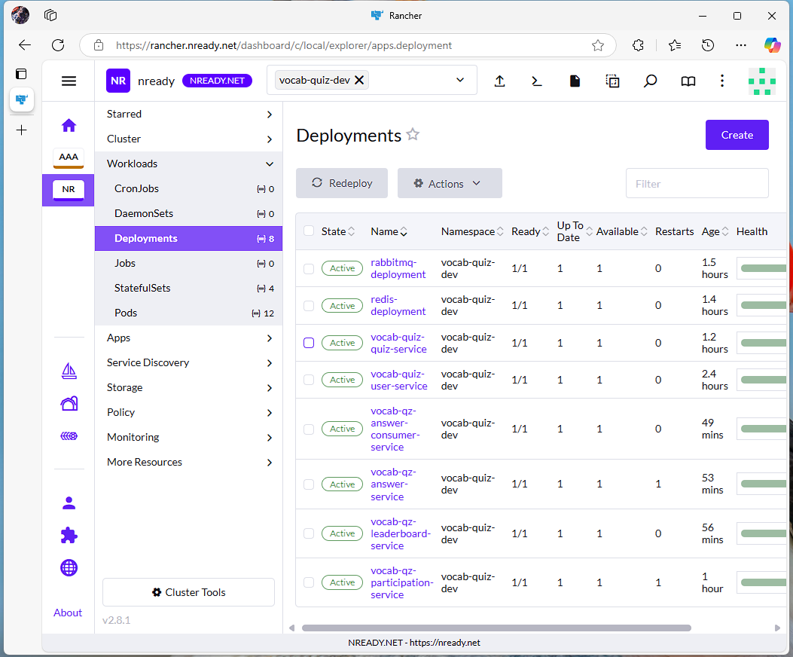

## Conclusion

The demo only provides an implementation of the architecture and covers most of the possible scenarios. The project need to be improved:

- UI App: A Flutter app that can run on Web, Windows Desktop, macOS, iOS, Android
- Implement WebSocket: Once UI App is implementing, the WebSocket need to be integrated.
- Admin Dashboard: To provide an end-to-end solution manage Quiz, Question, User,...
- Build Permission Matrix: To ensure only authorized user can interacte with their data

Beside that, the architecture covers most of the possible scenarios, using JWT to authenticate with the service, also between sevice-to-service. Keycloak is one of choice but for flexible and specific needs, self-implement is a choice. Token is expried and I have provide an enpoint to refresh token, on every sevice call each other, it has to introspect token before make request to ensure sevice is authorized to access.

The app use commons technology to adapt the requirement: 

   - **Scalability**: Build with Microservice architecture, de-coupling components and services with database will lead the stable and easy to scale up/down.
   - **Performance**: De-coupling service into microservice can lead the service run with lower memory, easy to deploy and manage in a ditributed system. Using Messaging Queue with RabbitMQ and Cache with Redis is the best choice to reduce database read dependencies.
   - **Reliability**: The app has build with snapshot in database, every changed on the table will be taken a snapshot. Using log on every important task to make it more easy to trace and debugging. If one service fails, it does not bring down the whole system, as other services can continue to function independently.
   - **Maintainability**: The app build with modules so easy to re-use and extend. (MessagingModule, RedisModule,...)
   - **Monitoring and Observability**: Build on top of K8s and GUIs for easily managing K8S, and I’ve opted for Rancher as the appropriate tool for deploying and managing K8S. 

## Author
Le Quoc Nam, leqnam@live.com
